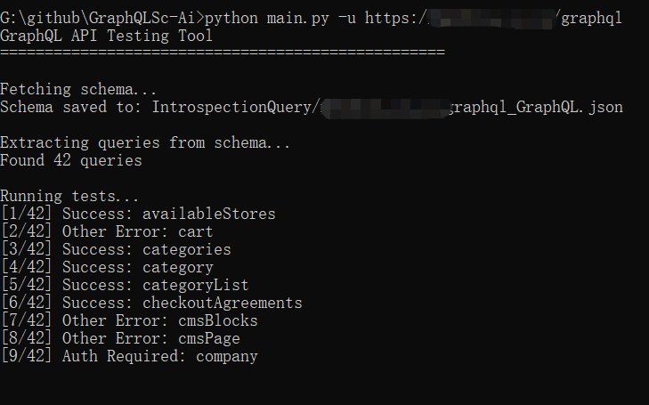
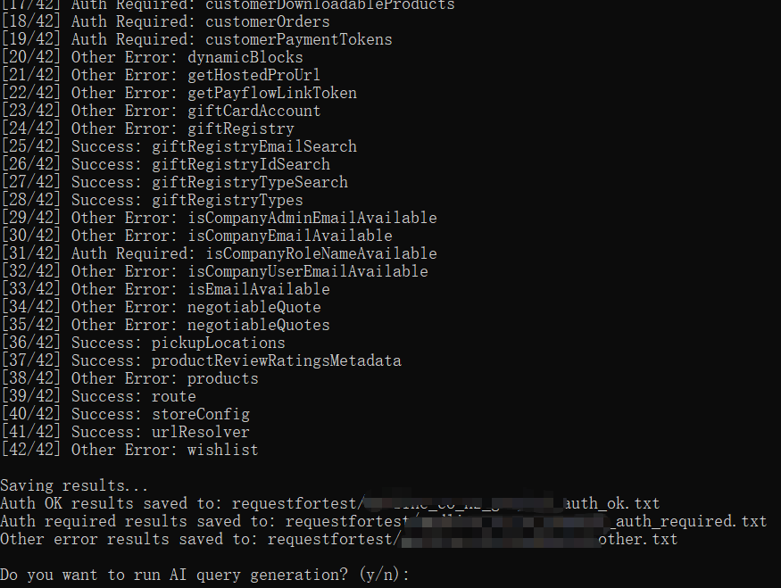
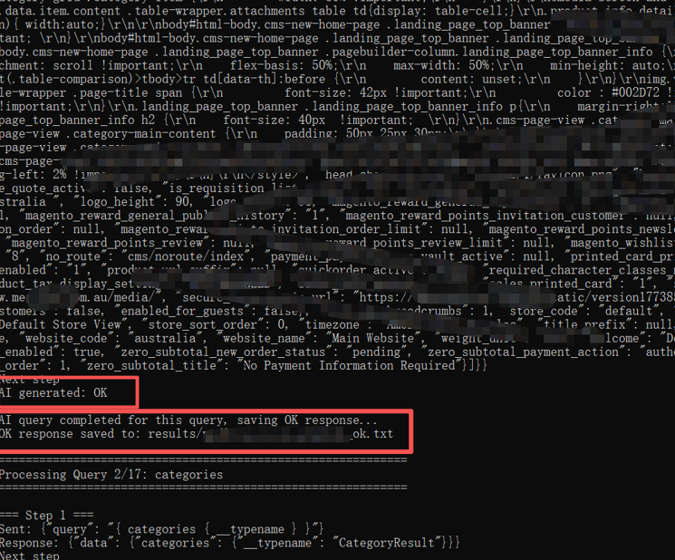

# GraphQLSc-Ai

一个基于 AI 驱动的 GraphQL 自动化探测工具，通过分析请求与响应的上下文，自动处理嵌套对象并构造 Payload，实现对复杂接口的“剥洋葱”式递归探测

--------------------------------------

Author：Seven1an

GitHub：https://github.com/Seven1an/GraphQLSc-Ai

## 介绍

作者在渗透测试中的反思，处理复杂 GraphQL 接口（如 Magento）时的逻辑复盘。在缺乏 API 文档且接口字段极其冗长的情况下，手动构造查询 Payload 效率极低，频繁复制粘贴问 AI 也非常繁琐。

核心思路是利用 **AI 对请求响应的上下文分析**，通过最简查询 `{ __typename }` 确定目标对象的真实类型，随后自动调用内省（Introspection）机制拉取字段定义。针对嵌套结构，自动对未知的子字段和关联对象发起循环探测，像剥洋葱一样剥开 Schema 架构，最终补全所有字段分支并发起完整查询请求

## 演示

演示用的是Magento系统

 

 

 

## 功能特性

- **Schema 自动获取**：自动从 GraphQL 端点获取完整的 Schema 定义

- **接口测试**：批量测试所有 GraphQL 查询接口

- **结果分类**：将测试结果分为三类（**成功**、需要授权、其他错误） 

- **AI 查询生成**：基于 AI 分析响应上下文，自动递归生成嵌套对象的查询语法

- **完整数据获取**：通过对单个接口的递归及对所有成功接口的遍历循环

  

**！！！注：目前只勉强实现了对成功这一类的探测！！！**

判断成功的标准是没有返回 "The current customer isn't authorized" 以及无其他网络造成的访问问题


## AI 查询生成规则

提示词让大模型分析当前接口的响应内容，并据此生成下一步的 GraphQL 查询语法。工具会自动识别返回结果中的 `__typename`，若存在嵌套对象，AI 将持续生成展开语法引导程序继续请求。当 AI 判定当前接口的所有深层字段均已获取完整数据后，会返回 "OK" 指令终止当前递归，并自动切换至下一个成功接口继续遍历**最终将OK的响应存入 `results/{目标}_ok.txt`。**

## 目录结构

```
GraphQLSc-ai/
├── main.py                 # 主入口文件
├── config/                 # 配置目录
│   ├── settings.ini       # 配置文件（API Key 等）
│   └── settings.py        # 配置加载模块
├── src/                    # 源代码目录
│   ├── __init__.py
│   ├── core/              # 核心业务逻辑
│   │   ├── __init__.py
│   │   ├── auth_analyzer.py    # 授权分析器
│   │   ├── query_builder.py    # 查询构建器
│   │   └── schema_parser.py    # Schema 解析器
│   ├── network/           # 网络请求模块
│   │   ├── __init__.py
│   │   └── http_client.py      # HTTP 客户端
│   ├── services/          # 服务层
│   │   ├── __init__.py
│   │   ├── schema_service.py   # Schema 服务
│   │   ├── testing_service.py  # 测试服务
│   │   ├── result_service.py   # 结果服务
│   │   └── ai_query_service.py # AI 查询服务
│   └── storage/           # 文件存储模块
│       ├── __init__.py
│       └── file_manager.py     # 文件管理器
├── ai/                     # AI 查询生成模块
│   ├── __init__.py
│   └── query_generator.py    # AI 查询生成器
├── IntrospectionQuery/     # Schema 存储目录（自动生成）
├── requestfortest/         # 测试结果目录（自动生成）
└── results/                # AI OK 响应目录（自动生成）
```

## 使用方法

```bash
python main.py -u url
```

## 配置说明

配置文件位于 `config/settings.ini`：

```ini
[ai_provider]
api_key = your_api_key_here
api_url = https://api.deepseek.com/v1/chat/completions
model = deepseek-chat
max_tokens = 2000
temperature = 0.1
request_timeout = 60

[graphql]
output_dir = requestfortest
query_name_prefix = Query Name:
```

# 结束语

这工具起初只写了 requestfortest 那三个分拣文件，后来想试试看能不能把 AI 塞进去自动跑。

目前的 AI 模块更多是起个辅助作用，毕竟不同的大模型对 GraphQL 语法的理解（或者说抽风概率）都不一样，我目前的水平也只能写到这儿了。真拿去用肯定还会碰到不少碎碎的小问题，就当是个半自动的小助手吧
